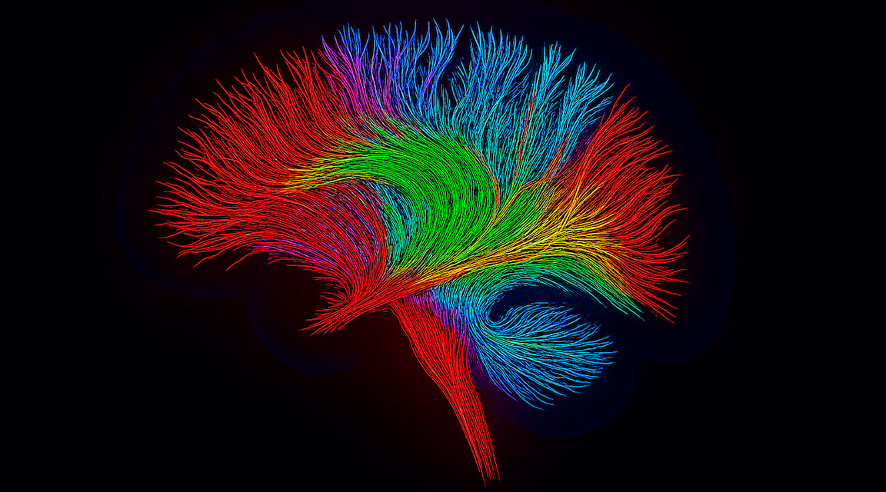

# TensorGrad

A tiny tensor autograd engine for **learning how deep learning works under the hood**. Powered by NumPy (or CuPy for GPU), it delivers a complete training pipeline in **under 600 lines of readable code** — including broadcasting, four optimizers (Adam, AdamW, SGD-momentum & Nesterov), and PyTorch-style APIs.

<div align="center">
  
</div>

## Why TensorGrad?

TensorGrad is *not* the fastest, feature-rich, or production-ready deep-learning library—that honour goes to the likes of PyTorch, JAX, or TensorFlow.  **Its goal is clarity.**

* Peek behind the curtain of automatic differentiation: every line is readable and hackable.
* Trace complete computation graphs to *see* how gradients flow.
* Prototype new ops or learning rules without wrestling a massive codebase.

What it is **not**:

* A drop-in replacement for heavyweight frameworks—performance (even with CuPy) is secondary.
* Feature-parity with PyTorch (no convolutions, mixed precision, distributed training, etc.).

If you want to *learn* how autograd engines work—or teach the concept—TensorGrad is purposely minimal while still powerful enough to train small neural networks end-to-end.

---

## Installation

TensorGrad has **no required dependencies** beyond NumPy and (for the test-suite) PyTorch & pytest.  GPU acceleration via CuPy is completely optional and can be installed at any time.

```bash
# clone the repo
$ git clone https://github.com/marwan_1265/tensorgrad.git
$ cd tensorgrad

# create a virtual env (optional)
$ python -m venv .venv && source .venv/bin/activate

# install runtime + dev extras
$ python -m pip install ".[dev]"
```

### Optional GPU acceleration (CuPy)

TensorGrad can run on GPUs via [CuPy](https://cupy.dev/).  Install the wheel that matches your 
CUDA version *before* running TensorGrad and select the backend with an environment variable:

```bash
# Example for CUDA 12 toolchain on Linux
pip install cupy-cuda12x

# Run any script with the GPU backend
TENSORGRAD_BACKEND=cupy python train.py

# or inside Python
>>> from tensorGrad import backend
>>> backend.use_cupy()
```

If CuPy or a CUDA driver is not available the backend quietly falls back to NumPy.

---

## tensorGrad training demo

For a step-by-step, runnable walkthrough open [`demo.ipynb`](demo.ipynb).
The notebook shows how to:

* download & preprocess the MNIST digits
* build a small three-layer MLP with TensorGrad layers
* optimise it with Adam (including a training loss curve)
* visualise the autograd graph with Graphviz
* evaluate accuracy against the test dataset

Launch it locally with

```bash
jupyter notebook demo.ipynb  # or use JupyterLab / VS Code
```

---

## Optimisers

TensorGrad now includes **four** optimisers located in `tensorGrad/optimize.py`:

* **Adam** – adaptive moment estimation
* **AdamW** – decoupled weight-decay variant of Adam
* **SGD with momentum** – Stochastic gradient descent with momentum
* **Nesterov accelerated gradient (NAG)** – 'look-ahead' momentum update

All optimiser classes expose a *common* interface, making it effortless to switch algorithms while experimenting:

```python
from tensorGrad.engine import Tensor
from tensorGrad.optimize import AdamW  # or Adam, SGD_M, Nesterov

# create some parameters
W = Tensor.randn(128, 64)
b = Tensor.zeros(64)

opt = AdamW([W, b], learning_rate=1e-3, weight_decay=0.01)

for x, y in data_loader:               # toy training loop
    pred = (x @ W + b).sigmoid()
    loss = ((pred - y) ** 2).mean()

    opt.zero_grad()                     # 1️⃣  clear previous grads
    loss.backward()                     # 2️⃣  back-prop
    opt.step()                          # 3️⃣  update parameters
```

The identical call-pattern (`zero_grad() → backward() → step()`) is shared with PyTorch, so porting code should feel familiar.

---

## Test-suite

The repository comes with an extensive pytest suite (≈40 individual assertions) that cross-checks every TensorGrad operator *and* optimiser against PyTorch.

```bash
$ pytest -q
.................................  # all dots = all green
```

Feel free to add your own tests as you extend the API.

---

## Acknowledgements

* **Andrej Karpathy – [micrograd](https://github.com/karpathy/micrograd)**, the original <300-line autograd engine that inspired this rewrite.
* PyTorch, from which I borrowed ideas such as `no_grad()` semantics and the test oracle.
* Everyone experimenting with tiny ML frameworks for showing that deep learning can be transparent and hackable!

---

## License

MIT © 2025 Marwan Abouzeid
